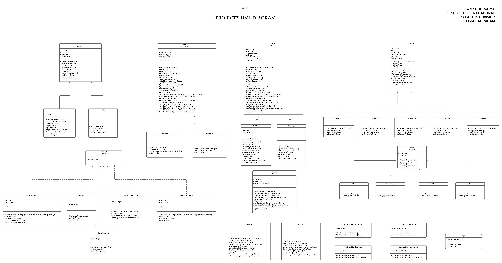

# Projet Logiciel

[Slides de notre soutenance du projet](https://www.canva.com/design/DAEefbCMta8/6USwWMbfaZv5gzulULIgqg/view?utm_content=DAEefbCMta8&utm_campaign=designshare&utm_medium=link&utm_source=publishsharelink&fbclid=IwAR0X2235prEYpSN9a6ZbCHHuBA_0oZj3UwrKFELZap7rbZGASOKu3tWu1gM#1)    |
:----------------------:|


[Project UML 1](https://lucid.app/lucidchart/invitations/accept/4f8a17c8-480b-4ca2-8235-d3d537886d8e)           |  [Project UML 2](https://lucid.app/lucidchart/invitations/accept/inv_707cc847-9e97-469c-88f4-3a06a72c8537)
:-------------------------:|:-------------------------:
  |  

[](http://makeapullrequest.com)

# Sujet
Réalisation et modélisation d’un jeu, cette modélisation permettra d’implanter différents jeux.
Les jeux ont une base commune mais les règles, les types de personnages, la composition du terrain de jeu pourront varier.

[Le sujet 2021](https://www.fil.univ-lille1.fr/portail/index.php?dipl=L&sem=S4&ue=Projet&label=Documents)

[Lien vers notre diagramme UML 1](https://lucid.app/lucidchart/invitations/accept/4f8a17c8-480b-4ca2-8235-d3d537886d8e)

[Lien vers notre diagramme UML 2](https://lucid.app/lucidchart/invitations/accept/inv_707cc847-9e97-469c-88f4-3a06a72c8537)

[Lien vers notre diaporama](https://www.canva.com/design/DAEefbCMta8/6USwWMbfaZv5gzulULIgqg/view?utm_content=DAEefbCMta8&utm_campaign=designshare&utm_medium=link&utm_source=publishsharelink&fbclid=IwAR0X2235prEYpSN9a6ZbCHHuBA_0oZj3UwrKFELZap7rbZGASOKu3tWu1gM#1)

# Equipe

Ce travail est à réaliser en équipe dont les membres sont :

- AZIZ **BOURAHMA**
- BENEDICTUS KENT **RACHMAT**
- CORENTIN **DUVIVIER**
- DORIAN **ABRAHAM**

# Organisation du projet

Le projet se répartit de la façon suivante :
- Un dossier *<strong>src</strong>* pour les fichiers sources composant ce projet.
- Un dossier *<strong>test</strong>* contenant des classes de test pour les différentes classes sources.
- Un dossier *<strong>documents</strong>* contenant des informations importantes concernant la conception de notre projet, notamment les diagrammes *<strong>UML</strong>*
- Un dossier *<strong>Makefile</strong>* contenant des instructions pour créer les classes, doc, etc.
- Un dossier *<strong>jar</strong>* contenant des fichiers jar exécutables.

# Livrables

## I ) Modélisation des personnages

Date : 07 / 02 / 2021

Ce Livrable 1 du projet, traite la représentation et la modélisation des *<strong>personnages</strong>*.

### a) Présentation du Livrable :

Pour ce Livrable I du projet, il s'agit bien évidemment de la représentation et la modélisation des *<strong>personnages</strong>*, mais aussi avant tout de se familiariser avec le sujet du projet qui lecture après lecture nous dévoile ses secrets, par ailleurs ces derniers nous font comprendre que la conception d'une partie ou d'une autre de ce projet ne peut se faire sans un regard et une réflexion attentive sur d'autres.

### b) Les choix qui ont été faits et pourquoi ?

Sans trop rentrer dans le détail des autres parties de la modélisation de ce jeu, qui sans doute influence nos choix faits pour la modélisation des *<strong>personnages</strong>*, on peut répartir notre travail sur ce premier livrable de la manière suivante :

#### - Première approche du problème :
En partant des idées de chacun de nous et des premiers éléments que nous avons puisés du sujet, il nous est tout de suite venu à l'esprit que les deux entités *<strong>ouvrier</strong>* et *<strong>guerrier</strong>* hériteront d'une seule et même *<strong>classe abstraite personnage* vu que ces deux dernières ont un certain nombre de *<strong>comportements en commun</strong>*, de plus, par exemple, si demain, l'entreprise qu'a développé ce jeu veut développer un autre qui par chance réutilise un des deux personnages à une fonctionnalité près, il est judicieux d'utiliser l'*<strong>héritage</strong>* qui permet la *<strong>réutilisation</strong>* d'un *<strong>code</strong>* déjà existant, sans avoir à tout réécrire.

#### - Après réflexion :
Comme évoqué ci-dessus, plus nous avançons dans la conception des *<strong>personnages</strong>* plus nous remettons en question certains de nos choix faits précédemment.

En effet, sur une tuile on ne peut accueillir qu'un seul *personnage* qui doit être soit un *ouvrier* soit une *armée*, mais d'après notre première approche, les *guerriers* peuvent prendre place sur une tuile alors que dans le sujet c'est bel et bien une armée constituée de guerriers qui doit occuper cette tuile et non un guerrier, d'où le fait qu'un personnage ne peut occuper directement une tuile.

Cela, nous a amené à revoir notre conception de *personnage* en ajoutant une entité *<strong>TileOccupant</strong>* que tout éventuel occupant d'une tuile devra implémenter car il s'agit d'une *<strong>interface</strong>* qui assure le *<strong>polymorphisme</strong>* sur l'occupant d'une d'une tuile et la encore *<strong>le choix se justifie</strong>* par le fait que *<strong>java ne permet pas l'héritage multiple</strong>*, tout au moins pour la modélisation du jeu de guerre, car pour un personnage ouvrier on aurait pu s'en passer.

### c) Le travail réalisé en équipe :

Combiner nos idées et mettre en avant une première version des diagrammes *<strong>UML</strong>* pour ce projet.
Pour ce Livrable II du projet, et dans la continuité de ce qui a été fait précédemment, une première version complète *<strong>(UML et code dont les tests)</strong>* a été mise en place pour les *<strong>personnages</strong>*.  

Il en est de même pour la représentation et la modélisation du *<strong>plateau</strong>* de jeu à travers la classe *<strong>Board.java</strong>* et les classes (*<strong>Tile.java</strong>*, *<strong>MountainTile.java</strong>*, *<strong>DesertTile.java</strong>* ...) en ce qui concerne les *<strong>tuiles</strong>* et la classe *<strong>Ressource.java</strong>* pour la modélisation des ressources.

### d) Les choix qui ont été faits et pourquoi ?

Sans trop rentrer dans le détail des autres parties de la modélisation de ce jeu, qui sans doute influencent nos choix faits pour la modélisation des *<strong>personnages</strong>*, on peut répartir notre travail sur ce premier livrable de la manière suivante :

### e) Structure des classes du livrable :

- De personnages également modélisés sur le même principe une classe abstraite *<strong>Personnage.java</strong>* regroupant les caractéristiques communes des personnages et deux autres classes *<strong>Army.java</strong>* et *<strong>Worker.java</strong>* adapté aux spécificités de chaque personnage.

   Ces classes sont implantées dans le paquetage *<strong>personnage</strong>*.

### f) A savoir :
- D'autres parties du projet ont été traitées, en effet afin d'avoir une idée globale et modéliser *personnage*, traiter d'autres parties du projet était plus qu'indispensable.
- Nous avons choisi de mettre en avant dans ce compte-rendu les points qui nous semblent les plus importants à mettre en avant, mais l'état et le comportement de l'ensemble des classes qui constituent cette première version de la modélisation de *personnage* sont bien représentés dans l'UML ci-dessus d'une maniére génèrale.
- Des difficultés restent tout de même à résoudre, notamment sur le fait de placer certains comportements dans une classe plutôt qu'une autre. Avons-nous soigneusement *<strong>structuré l'état</strong>* de nos entités ? ...

## II ) Modélisation du plateau et des tuiles

Date : 10 / 03 / 2021

Ce Livrable 2 du projet traite de la représentation et la modélisation du *<strong>plateau</strong>* de jeu et des *<strong>tuiles</strong>* qui le composent.

### a) Présentation du Livrable :

Pour ce Livrable II du projet, et dans la continuité de ce qui a été fait précédemment, une première version complète *<strong>(UML et code dont les tests)</strong>* a été mise en place pour les *<strong>personnages</strong>*.  

Il en est de même pour la représentation et la modélisation du *<strong>plateau</strong>* de jeu à travers la classe *<strong>Board.java</strong>* et les classes (*<strong>Tile.java</strong>*, *<strong>MountainTile.java</strong>*, *<strong>DesertTile.java</strong>* ...) en ce qui concerne les *<strong>tuiles</strong>* et la classe *<strong>Ressource.java</strong>* pour la modélisation des ressources.

#### - L'algorithme mis en place pour le plateau de jeu :

Le principe de notre algorithme pour le plateau de jeu suit le suivant :

   1. Choisir deux nombres aléatoirement correspondants à une case dans le tableau représentant le plateau de jeu.

   2. Vérifier que la case ne contient pas une tuile déjà placée sur cette case, autrement sa valeur est null.

   3. Si la case est vide, alors on Vérifie les cases adjacentes de cette case et :
      - Si au moins une case adjacente est occupée par une tuile non *<strong>Ocean</strong>*, alors on place une tuile choisie aléatoirement entre (*<strong>Forest</strong>*, *<strong>Mountain</strong>*, *<strong>Desert</strong>*, *<strong>Plain</strong>*).

      - Si aucune case adjacente est occupée par une tuile, alors on place une tuile choisie aléatoirement entre (*<strong>Forest</strong>*, *<strong>Mountain</strong>*, *<strong>Desert</strong>*, *<strong>Plain</strong>*) dans cette case et une autre sur une case adjacente pareillement choisie.

   4. En dernier, après avoir placé le 1/3 des tuiles non océan, on parcourt le tableau et on place une tuile océan sur chaque case libre restante.

#### - Quelques points sur notre code :
Dans l'implémentation de nos codes des classes nous avons essayé de mettre en place les différentes notions vus en S3 dans l'UE Programmation Orientée Objet :

- Des méthodes privées par exemple dans la classe Board.java, toute la décomposition du problème n’a pas besoin d’être connue du « programmeur utilisateur ».

- Mettre en place nos propres exceptions, de la création à leur capture en passant par leur déclenchement.

- Exploiter les différentes structures de données (Collections) en l'occurence *<strong>ArrayList</strong>* et *<strong>HashMap</strong>*.

- Exploiter les avantages de l'héritage notamment le mécanisme de *<strong>lookup</strong>* et la surcharge (*<strong>Overriding</strong>*) des méthodes.

### b) Structure des classes du livrable en paquetages :

Ce livrable est constitué de deux paquetages *<strong>board</strong>* pour la modélisation du plateau, *<strong>tile</strong>* pour celle des tuiles et un sous-paquetage *<strong>ressources</strong>* pour la modélisation des ressouces que produisent les tuiles, qui sont détaillés ci-dessous :

- Le plateau est modélisé par une classe abstraite *<strong>Board.java</strong>* et deux autres classes *<strong>WarBoard.java</strong>* et *<strong>FarmBoard.java</strong>* qui permettent que créer un plateau adapté aux spécificités de chaque jeu, ce dernier est de forme rectangulaire, dont la taille peut être choisie au lancement du jeu et il est divisé en tuiles.

   Ces classes sont implantées dans le paquetage *<strong>board</strong>*.

- Les tuiles représentent les territoires qui sont modélisés par la classe abstraite *<strong>Tile.java</strong>* et les classes *<strong>OceanTile.java</strong>*, *<strong>PlainTile.java</strong>* représentant un territoire de type plaine, *<strong>DesertTile.java</strong>* représentant un territoire de type desert, *<strong>ForestTile.java</strong>* représentant un territoire de type forêt, *<strong>MountainTile.java</strong>* représentant un territoire de type montagne, chaque tuile peut produire un type de ressource.

   Ces classes sont implantées dans le paquetage *<strong>Tile</strong>*.


- Les ressources sont modélisés par la classe abstraite *<strong>Resource.java</strong>* et les classes *<strong>CornResource.java</strong>*, *<strong>WoodResource.java</strong>* représentant une ressource de type bois, *<strong>SandResource.java</strong>* représentant un territoire de type sable, *<strong>RockResource.java</strong>* représentant un territoire de type roche, chaque ressource peut être convertie soit en or ou en nourriture selon le jeu.

   Ces classes sont implantées dans le paquetage *<strong>Resource</strong>*.

### c) Le travail réalisé en équipe :

Combiner nos idées et discuter des choix à faire pour l'implémentation de nos différentes classes de ce projet, mettre en avant une nouvelle version de nos diagrammes *<strong>UML</strong>* pour ce projet.

#### L'organisation du travail :

- Tous ensemble en équipe nous nous mettons d'accord sur les besoins et les résultats attendus.

- Nous avons travaillé en deux équipes de deux étudiants chacunes.

- Une équipe modélise et propose une première implémentation d'une classe donnée et l'autre s'occupe d'une autre.

- S'ensuit une présentation et une explication des choix qui ont été faits par chaque équipe.

- Enfin une équipe réalise les tests de la classe codée par l'autre équipe.


### d) A savoir :
- D'autres parties du projet ont été traitées, en effet afin d'avoir une idée globale et modéliser le *<strong>plateau, tuile, ressources</strong>*, notamment la partie *<strong>Player</strong>* et les éventuelles *<strong>actions</strong>*.

- Des difficultés restent tout de même à résoudre, notamment sur le fait de placer certains comportements dans une classe qu'une autre. Avons-nous soigneusement *<strong>structuré l'état</strong>* de nos entités ? ...

- Une réorganisation soigneuse et méthodique de nos sources et paquetages est à faire également.


## III ) Modélisation des actions

Date : 10 / 03 / 2021

Ce Livrable 3 du projet traite de la représentation et la modélisation des *<strong>actions</strong>* de ce jeu.

### a) Présentation du Livrable :

Jusqu'à présent les différentes actions que les joueurs doivent réaliser ont été plus ou moins réparties sur les différentes classes en l'occurrence sur les classes des personnages.

Le Livrable III de ce projet remédie à ça, en effet il est sujet de concentrer ces différentes actions à réaliser sous une hiérarchie bien définie, à savoir une interface *<strong>Action.java</strong>* qui définit une méthode *<strong>execute</strong>*  que les classes qui modélisent les principales actions ci-dessous détaillées et qu'*<strong>implémentent</strong>* *<strong>Action.java</strong>* devraient définir tout en ajoutant d'autres comportements à ces classes afin de répondre aux spécifications de chaque jeu.

- Les principales actions du jeu de guerre :

   - Déployer une armée sur une tuile disponible afin d’acquérir ce territoire (cette tuile), action modélisée par la classe *<strong>WarActionDeploy.java</strong>*.
   - Ne rien faire (ce qui permettra d’attendre de récolter), action modélisée par la classe *<strong>SkipAction.java</strong>*.

- Les principales actions du jeu agricole :

   - Déployer un ouvrier sur une tuile disponible afin d’acquérir un territoire (cette tuile), action modélisée par la classe *<strong>FarmActionDeploy.java</strong>*.
   - Echanger des ressources contre de l'or,action modélisée par la classe *<strong>ConvertResourceAction.java</strong>*.
   - Ne rien faire (ce qui permettra d’attendre de récolter), action modélisée par la classe *<strong>SkipAction.java</strong>*.


### b) Le choix qui a été fait pour la modélisation des actions et pourquoi ?

Le choix de modéliser les actions à l'aide d'une classe *<strong>interface</strong>* et des classes qui implémentent cette interface et qui modélisent proprement les différentes classes des actions citées ci-dessus nous permet la séparation des comportements, séparer "ce que fait" chaque comportement (action) de "la façon dont il le fait".

#### - La hiérarchie de notre modélisation des actions :

Le principe de notre modélisation des actions est la suivante :

- Une classe interface *<strong>Action.java</strong>* qui définit une méthode principale *<strong>execute</strong>*.

- Quatre classes *<strong>ConvertResourceAction.java</strong>*, *<strong>WarActionDeploy.java</strong>*, *<strong>FarmActionDeploy.java</strong>*, *<strong>SkipAction.java</strong>* qui implémentent la méthode *<strong>execute</strong>* de *<strong>Action.java</strong>* et bien évidemment d'autres méthodes qui concernent la mise en place de ces actions.

Cela nous permet d'avoir le polymorphisme sur les actions, l'action a exécuter n'est connue qu'au moment de l'invocation de la méthode execute sur un objet action, le principe du *<strong>late-binding</strong>*.

#### - Quelques points sur notre code :
Dans l'implémentation de nos codes des classes nous avons essayé de mettre en place les différentes notions vues en S3 dans l'UE Programmation Orientée Objet :

- Des méthodes privées par exemple dans la classe Board.java, toute la décomposition du problème n’a pas besoin d’être connue du « programmeur utilisateur ».

- Mettre en place nos propres exceptions, de la création à leur capture en passant par leur déclenchement.

- Exploiter les différentes structures de données (Collections) en l'occurence *<strong>ArrayList</strong>* et *<strong>HashMap</strong>*.

- Exploiter les avantages de l'héritage notamment le mécanisme de *<strong>lookup</strong>* et la surcharge (*<strong>Overriding</strong>*) des méthodes.

## IV ) Modélisation complète

Semaine : 12 / 04 / 2021

Ce Livrable 4 du projet traite de la modélisation complète de ce projet.

### a) Présentation globale du projet :

La modélisation pour implanter les deux jeux a bien été réalisée, cette modélisation permet également à un développeur de créer un nouveau jeu en se servant de ce qui est déjà réalisé ou en ajoutant modérément des classes pour s’adapter simplement aux spécificités de son jeu.

Ici deux versions de jeu sont présentées, une pour un jeu de guerre et une autre pour un jeu agricole. Les jeux ont une base commune mais les règles, les types de personnages, la composition du terrain de jeu varient d'un jeu à un autre.

- <strong> Principe général des jeux :</strong>

Le fonctionnement général des jeux qu’on créera suivra toujours le schéma suivant. Chaque joueur joue chacun son tour. Le nombre de tours de jeu est choisi au lancement du jeu. A chaque tour le joueur :

1. réalise des actions (par exemple positionner un personnage sur une tuile).

2. récolte des ressources (par exemple du blé).

3. distribue quelque chose à ses personnages (par exemple leur verse de l’or).

### b) Structure de notre projet en paquetages:

Ce projet est constitué d’un paquetage principal *<strong>game</strong>* qui est constitué à son tour :

- Pour les personnages voir ci-dessus *<strong>Livrable I</strong>*.
- Pour les plateau de jeu, les tuiles et les resources voir ci-dessus *<strong>Livrable II</strong>*.
- Pour les actions voir ci-dessus *<strong>Livrable III</strong>*.

- Pour les joueurs, ils sont à leur tour modélisés sur le même principe par une classe abstraite *<strong>Player.java</strong>* regroupant les caractéristiques communes des joueurs et deux autres classes *<strong>WarPlayer.java</strong>* et *<strong>FarmPlayer.java</strong>* adapté aux spécificités de chaque joueur d'un jeu. Ces joueurs manipulent des personnages qu’ils vont pouvoir
positionner sur les tuiles et récoltent les ressources produites par les tuiles et qui peuvent être converties selon le jeu.

   Ces classes sont implantées dans le paquetage *<strong>player</strong>*.

- De classes d'exceptions par exemple la classe *<strong>NotEnoughFeedException.java</strong>*.

   Ces classes sont implantées dans le paquetage *<strong>exception</strong>*.

- Les jeux sont modélisés sur le même principe par une classe abstraite *<strong>Game.java</strong>* regroupant les caractéristiques communes aux différents jeux et deux autres classes *<strong>WarGame.java</strong>* et *<strong>FarmGame.java</strong>* adapté aux spécificités de chaque jeu.

   Ces classes sont implantées dans le paquetage *<strong>games</strong>*.

- D'une classe *<strong>Input.java</strong>* permettant de lire sur l'entrée standard.

   Cette classe est implantée dans le paquetage *<strong>io</strong>*.

- Enfin, des classes principales *<strong>MainGuerreGame.java</strong>*, *<strong>MainAgricoleGame.java</strong>*, *<strong>MainFarmInteractiveGame.java</strong>*, *<strong>MainWarInteractiveGame.java</strong>* permettant de lancer une partie de jeu choisie.

### c) Analyse du contenu de notre projet :

Tout au long de ce projet, nous avons veillé à :

- Une bonne répartition des classes dans les différents paquetages.
- La présence d’un *<strong>readme</strong>* à jour et expliquant les différentes composantes du projet.
- Une explication de comment lancer le projet avec ses éventuels paramètres.
- La documentation de chacune des classes du projet.
- Couvrir le plus possible notre code par les tests.
- Commenter notre code à travers la *<strong>Javadoc<strong>*, *<strong>commentaire pertinent </strong>* ...
- A choisir des noms parlants pour les paquetages et les classes, des noms qui nous apprennent quelque chose de façon plus générale.
- De même pour les méthodes, on a essayé de choisir des noms parlants.

### d) Exploitation du projet :

#### 1 ) Compilation des classes

A l'aide de la commande ci-dessous ça va créer le dossier classes et compiler tous les sources
```bash
$ ../l2s4-projet-2021-G6/src> make cls
```

#### 2 ) Exécution des tests

Il faut compiler maintenant les classes de test (ActionTest.java, PlayerTest.java, etc), en vous plaçant à la racine du projet et en exécutant la commande suivante :
```bash
$ ../l2s4-projet-2021-G6> make test
```

Exécutez les tests d'une class donnée, depuis la racine du projet, notez bien qu'il faut toujours spécifier le chemin vers la classe :
```bash
../l2s4-projet-2021-G6> java -jar test.jar chemin.nom_de_test
```

pour la classe *<strong>MountainTileTest.java</strong>* par exemple exécutez la commande :
```bash
../l2s4-projet-2021-G6> java -jar test.jar game.tile.MountainTileTest
```

#### 3 ) Génération de la documentation

Pour générer la documentation du projet, exécutez la commande ci-dessous pour créer la documentation :
```bash
$ ../l2s4-projet-2021-G6/src> make doc
```

#### 4 ) Création d'une archive exécutable

Ci-dessous les commandes a exécuter pour créer un .jar exécutable selon le jeu et la stratégie souhaitée. 

```bash
Pour une partie de jeu guerre dont les joueurs jouent aléatoirement.
$ ../l2s4-projet-2021-G6> make guerre

Pour une partie de jeu agricole dont les joueurs jouent aléatoirement.
$ ../l2s4-projet-2021-G6> make agricole

Pour une partie de jeu guerre dont la stratégie de jeu des joueurs peut être choisie.
$ ../l2s4-projet-2021-G6> make guerreHuman

Pour une partie de jeu agricole dont la stratégie de jeu des joueurs peut être choisie.
$ ../l2s4-projet-2021-G6> make agricoleHuman
```
#### 5 ) Exécution d'une archive exécutable

Ci-dessous les commandes a exécuter pour exécuter un .jar exécutable selon le jeu et la stratégie souhaitée. 

```bash
Pour une partie de jeu dont les joueurs jouent aléatoirement.

$ ../l2s4-projet-2021-G6> java -jar jar/guerre.jar Raymond Odette
$ ../l2s4-projet-2021-G6> java -jar jar/agricole.jar Vigneron Eleveur Maraicher

Pour une partie de jeu dont la stratégie de jeu des joueurs peut être choisie.

$ ../l2s4-projet-2021-G6> java -jar jar/guerreHuman.jar Raymond 1 Odette 0
$ ../l2s4-projet-2021-G6> java -jar jar/agricoleHuman.jar Vigneron 1 Eleveur 0 Maraicher 1
```
<strong>NOTE : </strong> pour le guerreHuman.jar et agricoleHuman.jar, si vous voulez avoir une stratégie humaine mettez 1 et 0 pour une stratégie aléatoire (example : java -jar jar/guerreHuman.jar Raymond 1 Odette 1)

#### 6 ) Génération l'archive

Pour générer l'archive du projet, exécutez la commande ci-dessous :

```bash
$ ../l2s4-projet-2021-G6/src> make archive
```

#### 7 ) Nettoyage de projet

Pour nettoyer le répertoire du projet, exécutez la commande ci-dessous :

```bash
$ ../l2s4-projet-2021-G6/src> make clean
```

Merci d'avoir lu cette documentation.

# Journal de bord

Début du journal de bord : Vendredi 12 février

## Semaine 1
- La première chose que nous avons faite a été de modifier considérablement une partie de notre UML. En effet, à l'origine nous avions décidé de créer une interface TileOccupant, une classe abstraite Personnage, une classe Worker, une classe Army et une classe Warrior dont les objets constituent une Army. Ce que nous avons fait, c'est fusionner TileOccupant et Personnage afin de n'avoir plus qu'une classe abstraite, et de supprimer la classe Warrior et la liste de Warrior dans la classe Army, et de remplacer celle-ci par un compteur qui représente le nombre de guerriers dans l'armée.

## Semaine 2
- Cette semaine, nous avons décidé de commencer le code en créant les classes de notre projet. De plus, nous avons revu encore une fois notre UML. Nous avons décidé de créer deux classes WarPlayer et FarmPlayer car certaines des méthodes de notre classe Player n'étaient destinées qu'à l'un des deux jeux que nous devons créer. Du côté des ressources, nous avons changé notre énumération en classe afin d'avoir plus de flexibilité. Nous avons également revu le code des classes de cases, notamment leurs constructeurs.

## Semaine 3
- Pour cette semaine, notre objectif était de finir la modélisation et le code de l'ensemble des personnages des deux jeux. Nous avons donc
commencé par coder la classe Personnage avant de faire les classes spécifiques à chacun des deux jeux. Nous avons ensuite créé des tests afin
de pouvoir vérifier notre code.

## Semaine 4
- Nous avons consacré cette semaine au codage du plateau. Pour ceci, nous devions tout d'abord coder les classes des différentes tuiles
afin de pouvoir les créer et les placer dans la classe Board. Nous avons également mis à jour quelques méthodes de nos classes de personnages et corrigé certains tests. Pour finir, nous avons créé d'autres exceptions : une qui concerne les armées vides, et une pour les tuiles inconnues.

## Semaine 5
- Cette semaine, nous avons continué à mettre à jour nos différentes classes. Nous avons également mis à jour notre diagramme UML.

## Semaine 6
- Cette semaine était consacrée au développement des actions des joueurs. Nous avons grandement développé le code de nos actions en y implémentant diverses fonctions comme la conversion de ressources ou bien le déploiement d'un ouvrier. Le faire n'était pas chose facile : tout le monde avait des avis différents, et le choix d'une interface Action a été fait plutôt qu'une classe abstraite.

## Semaine 7
- Nous avons consacré cette semaine au développement des classes des jeux de notre projet, plus particulièrement le jeu de guerre. Nous avons également revu le code de certaines de nos classes.

## Semaine du 10 au 16 mai
- Finalisation du code source, correction de bugs, ajout de certains tests et début de la création du diaporama pour la soutenance du 27 mai.

## Semaine du 17 au 23 mai
- Diaporama et couverture de code terminés.